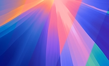

# Sequoia Graphic Wallpaper

The 6K abstract wallpaper set from macOS Sequoia, packed into a **solar-aware HEIC**.

---

macOS Sequoia’s abstract Graphic wallpaper is not a set of static files, but is dynamically rendered using Metal. Existing resources on the internet are usually static Light versions (easy to locate at `/System/Library/CoreServices/DefaultBackground.jpg`) or low-resolution Light & Dark screenshots.

I used a magic method (don’t ask) to capture all possible instances of Sequoia under **various sunlight angles**, all at **6016 × 6016** resolution (the same quality as the official ones). These static instances are in the `P3` directory of this project; the packed HEIC is in the root as `Sequoia Graphic.heic`.

Notes:

- The wallpapers don’t animate; that’s beyond the capability of HEIC.
- Please be aware that the graphic contents are copyrighted by Apple.
- If you set custom dynamic wallpapers on macOS Mojave, the `Automatic/Light/Dark` and `Fill Screen/...` pop-up buttons may overlay. Use keyboard navigation to select options.
